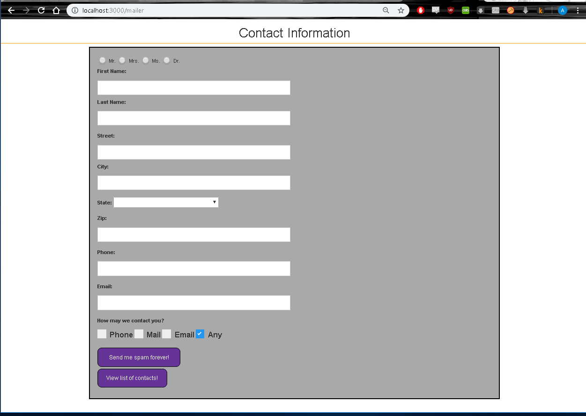
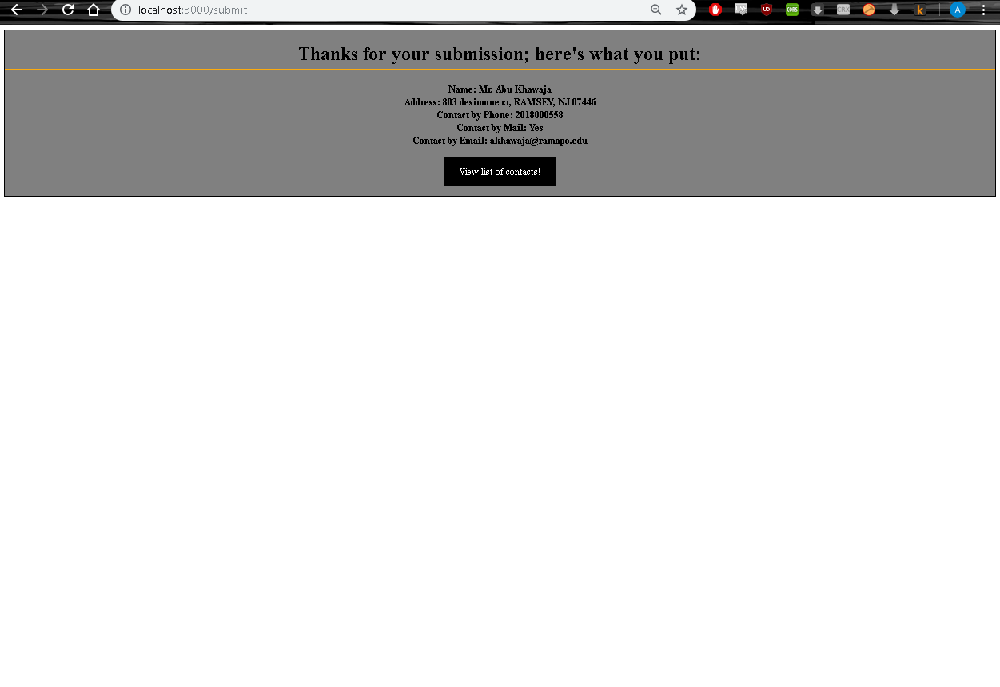
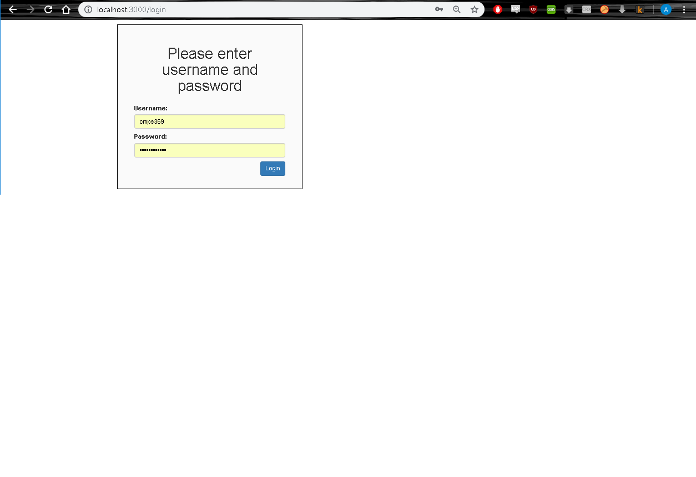
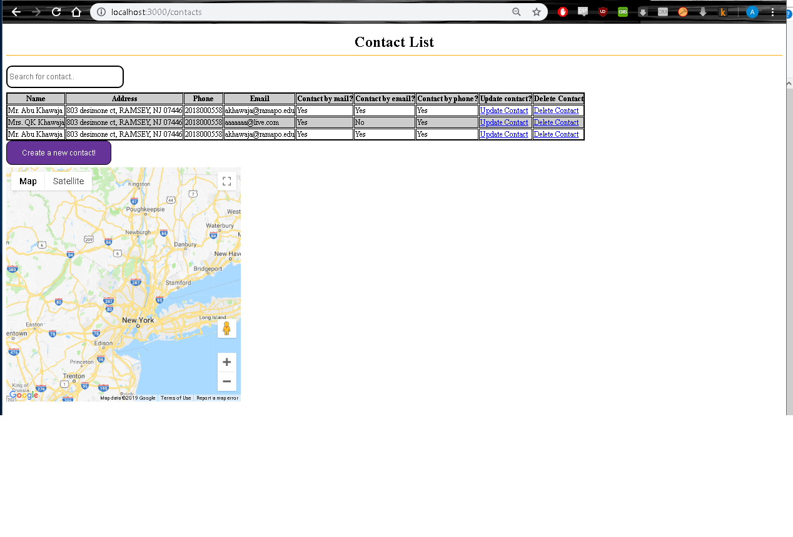

# SecureContactForm

A fully functioning web application that gathers and lsits contact information. The server code is written using Node.JS and EJS is used for dynamic page generation. 

The initial /mailer page collects information and then the submit button sends a POST request to the server. 

The /submit page displays what the user input in the /mailer page previously and then has a button to see the full list of contacts.

The full list of contacts can only be viewed if logged in -> the /login page utilizes Passport to check user credentials to login.

The /contacts page displays a list of the contacts with options to delete or update any particular contact. It also allows for a single-page search to see if a contact is within the list.

